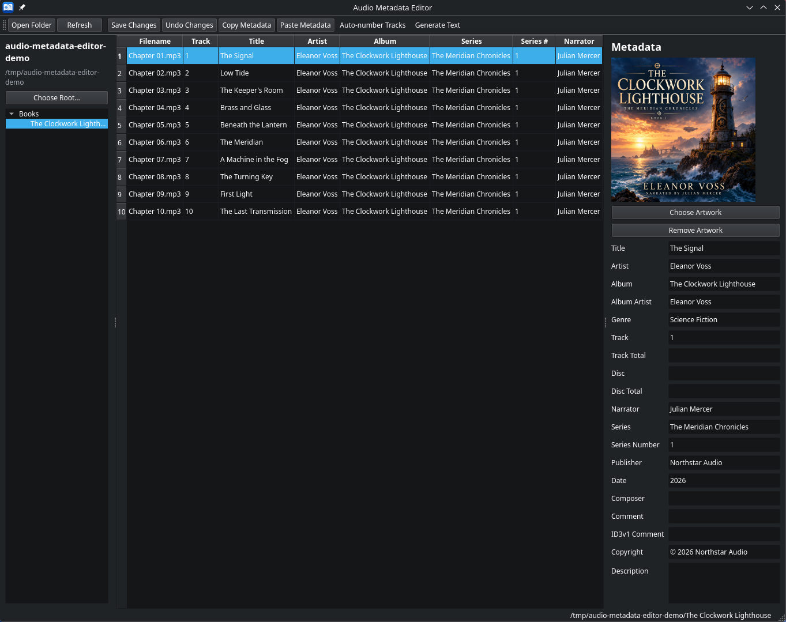

# Audio Metadata Editor

A desktop metadata editor for MP3 and M4B audiobooks, built for precise manual
editing and predictable saves.



## Key features

- Folder navigation and a sortable metadata table.
- Single-file and multi-file editing, with existing-value choices for shared edits.
- Audiobook fields including narrator, series, series number, publisher, and description alongside standard music metadata.
- Artwork preview, replacement, and removal.
- Auto-number Tracks, Generate Text with template previews, and Copy Down / Copy Up.
- Copy Metadata and selective Paste Metadata.
- Remembered navigator root and Generate Text settings.

Metadata is stored in the audio files; no library database is required.
Double-click a filename to open it with its associated desktop application.

## Editing and saving

**Some actions save immediately; others create pending edits.**

| Action | When files are written |
| --- | --- |
| Edit the metadata panel | On **Save Changes**, or **Save** in an Unsaved Changes prompt. |
| Edit a center-table cell | **Enter immediately saves that field**, then advances to the next row where possible. Leaving the editor without Enter discards its unconfirmed text. |
| Auto-number Tracks | **OK immediately saves** track numbers for the selected files in their current visual order. |
| Generate Text, Copy Down / Copy Up, Paste Metadata | These create pending edits; **Save Changes** writes them. |
| Choose or Remove Artwork | These create pending edits; **Save Changes** writes them. |

Selection and folder changes, Refresh, and closing protect pending edits with
**Save / Discard / Cancel**. **Undo Changes** reloads current disk values; it does
not reverse completed saves.

## Supported formats and platform

- Audio files: `.mp3` and `.m4b`, case-insensitive.
- Developed and tested on Linux. Windows and macOS have not been verified.
- Declared Python requirement: **3.12 or newer**. This is not a claim that every
  supported Python version has been tested.
- A graphical desktop environment is required to run the application.

## Installation from source

Obtain a checkout of this repository and run these commands from its root, using
Python 3.12 or newer:

```sh
python3 -m venv .venv
source .venv/bin/activate
python -m pip install -e .
```

This installs the application and its PySide6 and Mutagen dependencies into the
virtual environment.

## Running

With the virtual environment activated:

```sh
audio-metadata-editor
```

Choose **Open Folder** to open an audiobook folder, or **Choose Root…** to set up
the remembered folder navigator.

## Documentation

- [User guide](docs/user-guide.md): workflows, fields, shortcuts, and failure handling.
- [Requirements](docs/requirements.md), [architecture](docs/architecture.md), and
  [testing](docs/testing.md): developer documentation.
- [Explicit-save decision](docs/decisions/001-explicit-save-model.md).

## Important limitations

- Folder loading includes audio files directly in the chosen folder, not its descendants.
- Audio-file symlinks are intentionally unsupported.
- Artwork selected from an image file supports JPEG and PNG up to **20 MiB**. Some embedded artwork may be preserved even when it cannot be previewed.
- Saves modify audio files directly. Batch operations can partially succeed; earlier writes are not automatically rolled back. Keep backups and avoid concurrent editing in another application.
- Field-specific edits aim to preserve unrelated metadata and artwork, backed by regression tests. This is not a guarantee of byte-identical preservation of every unknown, malformed, or nonstandard tag.

## License

[MIT License](LICENSE). Copyright (c) 2026 Patrick Edlund.
