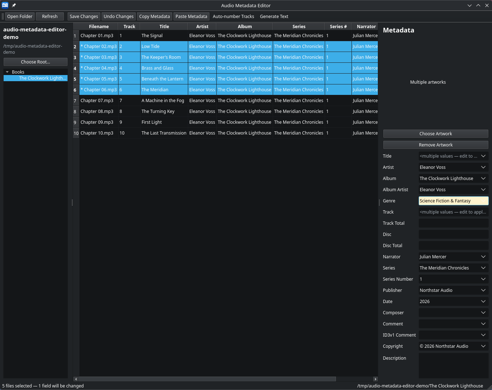
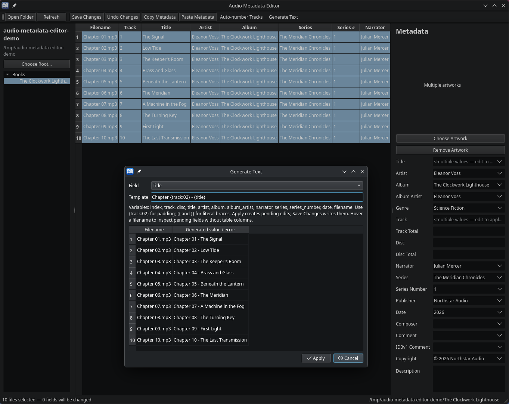

# Audio Metadata Editor user guide

Audio Metadata Editor edits metadata stored in MP3 and M4B audiobook files.
It has no separate library database. This guide describes the v0.1.0 workflows.

## Getting started

Follow the [source installation and launch instructions](../README.md#installation-from-source).
Choose **Open Folder**, select a folder containing `.mp3` or `.m4b` files, and
select a row to view its metadata. Extension matching is case-insensitive.

The main window has a folder navigator on the left, a sortable file table in the
center, and a scrollable metadata panel on the right. Select multiple rows with
the usual Ctrl/Shift selection gestures to edit several files together.

**Before editing, distinguish immediate saves from pending changes:**

| Workflow | Save action |
| --- | --- |
| Metadata panel, artwork, Paste Metadata | Save Changes or Save in an Unsaved Changes prompt |
| Generate Text and Copy Down / Copy Up | Apply/copy creates pending changes; Save Changes writes them |
| Center-table cell edit | Enter immediately writes that field |
| Auto-number Tracks | OK immediately writes selected track numbers |

Keep backups: saves modify the audio files themselves.

## Folder navigation

**Choose Root…** sets and remembers the navigator root. The heading shows its
name and path; **Books** is a navigation label for that root, not a folder the
application creates. Expand subfolders as needed; their children are loaded
lazily. Hidden and symlinked child directories are omitted from the navigator.

Selecting a folder loads supported audio files directly inside it. Selecting a
parent does not combine audio files from its descendants. Audio-file symlinks
are omitted and are not supported for editing.

**Open Folder** opens an arbitrary folder without changing the remembered root.
If it is outside the displayed tree, the navigator may have no selected item.

**Refresh** reloads the current folder, including externally changed metadata and
added or removed files. It first guards pending edits, clears file selection on
successful reload, and retains the navigator's context. It does not reset the
current folder to the root.

On startup, the application restores a readable remembered root. If it is
unavailable, choose a root or use Open Folder; no substitute root is chosen.

## Table navigation and editing

Click a column header to sort. The table shows Filename, Track, Title, Artist,
Album, Series, Series Number, and Narrator. Double-click a filename to open the
audio file with the desktop's associated application; this is not built-in
playback.

Double-click a metadata cell to edit it. Its text is transient until you press
**Enter**. Enter saves only that field, preserving unrelated metadata and
artwork. After a successful save, editing continues in the same column of the
next row in the resulting sorted order. It stops at the last row.

Focus loss, selection changes, Tab, Escape, changing folders, Refresh, and closing
do not save unconfirmed table text. Leaving the editor abandons that text.
Invalid input does not save or advance. A save failure also stops advancement.

If advancing would discard unrelated pending panel edits, an Unsaved Changes
prompt can appear after the table save. Cancelling the transition does not undo
the field that was already saved.

## Metadata panel

The panel exposes title, artist, album, album artist, genre, track/disc numbers
and totals, narrator, series, series number, publisher, date, composer, comment,
ID3v1 Comment, copyright, description, and artwork.

Panel edits remain pending. Pressing Enter or moving focus does not write them.
Click **Save Changes** or press **Ctrl+S** to save. Changing a field and restoring
its saved value normally clears that field's pending change. After a failed or
unverified save, further verification or an explicit reload may still be needed.

Track and disc numbers and their totals are independent: editing one does not
implicitly replace the other. Scroll the panel to reach lower fields.

## Single-file and multi-file editing

With one file selected, the panel shows its values. With multiple files selected,
common values are shown normally and differing values have a mixed-value
placeholder. Selecting files or viewing a placeholder does not edit them.

Typing or explicitly choosing a value in a multi-file field applies that pending
value across the selection. Leaving other fields untouched preserves their
individual values. Explicitly clearing a mixed field requests a blank value.



Single-line text fields offer **Existing values** choices during multi-file
editing. Open the dropdown or press **Alt+Down**. Choose **Empty** to clear the
field; a stored literal value `Empty` is displayed quoted. You can also type a
new value. Opening or browsing the menu alone does not create an edit.

Row asterisks indicate pending changes or saves awaiting verification. Files
already matching the requested changes can remain unmarked.

## Saving and unsaved changes

**Save Changes** writes pending panel, generated, copied, pasted, and artwork
changes. Successful saves are checked by reading metadata back from disk.

Changing selection or folders, using Refresh, or closing with pending changes
prompts for:

- **Save:** attempt to save before continuing. Failed or unconfirmed saves prevent the transition.
- **Discard:** abandon pending edits. When continuing in the application, current disk values must be reloaded successfully. Closing with Discard exits without rolling back prior writes.
- **Cancel:** keep the current editing context and pending work.

Saving is not a transaction across multiple files. Earlier writes can remain on
disk if a later file fails. See [Error and failure behavior](#error-and-failure-behavior).

## Undo Changes

**Undo Changes** discards pending edits by reloading the selected files' current
metadata from disk. It is not multi-level edit history and cannot reverse an
Enter-save, completed Auto-number operation, or other completed write.

If reloading fails, pending work is retained and an error is reported. Ctrl+Z is
focus-dependent: in a text editor it uses that editor's undo behavior; outside
text editors the main window handles it as Undo Changes.

## Auto-number Tracks

1. Select the files to number and sort them into the desired visual order.
2. Choose **Auto-number Tracks…**.
3. Enter a positive starting track number; the default is 1.
4. Click **OK** to write consecutive track numbers immediately.

Only track numbers are changed; track totals and unrelated metadata remain
untouched. Cancel makes no changes. Numbering stops at the first failure, and
earlier successful writes are not rolled back.

## Generate Text

Select files and choose **Generate Text…**. Choose a target field, enter a
template, and inspect the per-file preview. **Apply** creates pending edits;
**Save Changes** is still required to write them. Invalid templates or missing
required source values prevent Apply.



Targets are Title, Artist, Album, Album Artist, Genre, Date, Composer, Publisher,
Copyright, Narrator, Series, and Series Number. Numeric fields, comments,
Description, and artwork are not generation targets.

Supported variables:

```text
{index} {track} {disc} {title} {artist} {album} {album_artist}
{narrator} {series} {series_number} {date} {filename}
```

Examples:

| Template | Meaning |
| --- | --- |
| `Chapter {track:02}` | Use the saved track number, padded to at least two digits |
| `{index:03} - {title}` | Prefix the saved title with a three-digit selection index |
| `{series} - {filename}` | Combine saved series text with the actual filename |

`index` starts at 1 in the selected files' visual order. Sources use accepted
metadata, not unsaved panel text. Missing Track or Disc values cause an error
when the template needs them. Padding is available only for index, track, and
disc, with a width up to 100. Use `{{` and `}}` for literal braces. Expressions
and arbitrary formatting are not supported.

Generated edits appear in applicable table columns; hover a filename to inspect
pending generated fields without table columns. Later edits to the same field
can replace earlier generated or copied intent. Unrelated pending fields remain.
The last successfully applied target and template are remembered across launches.

## Copy Down / Copy Up

Select the source cell and the target rows, then use the table context menu's
**Copy Down** or **Copy Up**. The active cell is the source; only selected rows
strictly below or above it in the current visual order are targets.

Supported columns are Title, Artist, Album, Series, Series Number, and Narrator.
Track and Filename are excluded. Shortcuts are **Ctrl+D** and **Ctrl+Shift+D**
while working in the table.

These actions create pending edits and require Save Changes. They use the cell's
current accepted or pending copied/generated value, not unconfirmed text in an
open table editor. The source and unrelated fields remain unchanged.

## Copy Metadata / Paste Metadata

Select exactly one file and choose **Copy Metadata** (**Ctrl+Shift+C**). This
reads that file's saved metadata into the application-local clipboard. It does
not copy unsaved panel edits and is separate from the desktop text clipboard.

Select one or more targets, choose **Paste Metadata** (**Ctrl+Shift+V**), and
choose the fields to paste. Selected fields become pending edits; Save Changes
persists them. Cancel leaves editing state unchanged.

Selecting Artwork in the paste dialog requests replacement with the copied
cover. If the copied file has no artwork, it requests removal where targets have
covers, and can cancel a pending artwork addition. Leave Artwork unselected to
preserve target covers.

## Artwork

**Choose Artwork** accepts valid JPEG or PNG content from a regular, non-symlink
file. Each encoded image must be **20 MiB or smaller** (20 × 1024 × 1024 bytes).
Exactly 20 MiB is allowed. Filename extensions alone do not determine whether an
image is accepted. Rejected selections preserve earlier artwork intent and
unrelated edits.

Choosing artwork creates a pending replacement. On Save, replacement replaces
the existing cover collection with one image, even when it matches the displayed
cover. **Remove Artwork** requests removal of all covers on Save. Removing
artwork from an artwork-free file is a no-op; it can cancel a pending addition.

Embedded artwork that is unsupported, invalid, or oversized may have no preview.
That does not mean it is absent: unrelated metadata edits preserve it unless you
explicitly replace or remove it. The application does not provide a multi-cover
management interface.

Paste Metadata also rejects oversized artwork replacements. It copies embedded
artwork and does not necessarily repeat the chooser's JPEG/PNG validation;
copied unsupported artwork may therefore have no preview. Do not treat successful
paste as proof that an image passed the chooser's validation.

## Field-specific details

- **ID3v1 Comment:** this is a logical MP3 comment field, not an editor for the physical legacy ID3v1 trailer. Editing it does not create or rewrite that trailer. It is disabled in the panel for M4B or mixed MP3/M4B selections; nonempty values cannot be saved to M4B.
- **Date:** use `YYYY`, `YYYY-MM`, `YYYY-MM-DD`, or a full date with `HH`, `HH:MM`, or `HH:MM:SS`. Dates must be valid; timezones and fractional seconds are not supported. MP3 ID3v2.3 accepts only year, full date, or full date with hour/minute precision; v2.4 and M4B support the broader forms. Zero seconds can be represented as minute precision.
- **Numbers:** M4B track/disc components must fit 0–65535; zero represents absence. Table Track editing accepts positive integers or blank. Invalid values are rejected rather than silently truncated.
- **Series Number:** the panel retains text, allowing values that are not whole numbers. The table editor requires a positive numeric value or blank; use the panel for other text.
- **Long single-line values:** values too long for the editor are retained and shown with a read-only notice. Use **Replace value** explicitly before entering replacement text. Unrelated saves preserve the complete original value.
- **MP3 metadata:** existing ID3v2.3/v2.4 versions are preserved. Valid untagged MP3s receive tags only when explicitly saving nonempty metadata or artwork. Some values, including unstable multi-genre representations, are rejected when they cannot be stored faithfully.

## Error and failure behavior

Folder loading reports unreadable files while still loading readable ones. A
failed selection or required reload does not replace accepted editing state with
empty metadata. Errors during artwork selection preserve pending work.

A writer can fail after modifying a file. A write can also complete while its
readback verification fails. In either case, do not assume the file is unchanged
or that an error means rollback. The application retains pending or unverified
state rather than falsely reporting a confirmed successful save.

Multi-file saves can partially succeed: earlier writes can remain, and later
files may not have been attempted. Before retrying, follow the application's
reported state, progress, and file path. Some changes may already be on disk even
if verification could not be completed; an error does not mean they were rolled
back.

Undo Changes or Discard reloads current disk truth when continuing to edit; it
cannot recover a pre-save version. Cancel retains the editing context. Keep
backups if you need to recover earlier file contents.

## Limitations and safe use

Developed and tested on Linux. Windows and macOS have not been verified.
Supported audio extensions are `.mp3` and `.m4b`; generic M4A/MP4 editing is not
advertised. Audio-file symlinks are intentionally unsupported.

The application edits metadata, not audio content. It does not provide playback,
chapter editing, audio conversion, filename renaming, or online metadata lookup.
Opening a filename delegates to an associated desktop application.

Avoid editing the same files concurrently in another metadata application:
reapplying pending values can overwrite newer changes to those fields. Batch
saving is not atomic, and completed writes are not automatically rolled back.

Field-specific edits aim to preserve unrelated metadata and artwork, with
regression tests covering that behavior. This is not a promise of byte-identical
preservation of every unknown, malformed, or nonstandard tag.

## Keyboard shortcuts

| Shortcut | Context and effect |
| --- | --- |
| Ctrl+S | Save Changes |
| Ctrl+Shift+C | Copy Metadata from exactly one saved file |
| Ctrl+Shift+V | Open Paste Metadata field selection |
| Ctrl+D | Copy Down in an eligible table column |
| Ctrl+Shift+D | Copy Up in an eligible table column |
| Alt+Down | Open Existing values in a multi-file text field |
| Enter | In a table editor: immediate field save; in the metadata panel: not a save |
| Delete | Outside text editors, the main window handles it as pending artwork removal; inside text editors it remains text editing |
| Ctrl+Z | Outside text editors, Undo Changes; inside text editors, editor undo |

[Back to README](../README.md)
